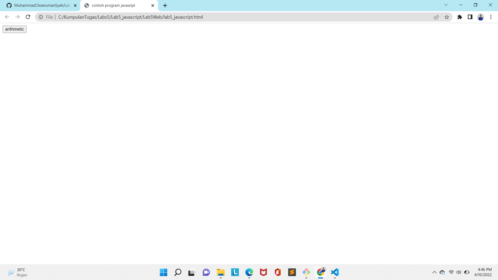

# Praktikum5
# Lab5Web
# Lab5Web

Membuat dokumen HTML dengan nama file lab5_javascript.html seperti berikut.
<!DOCTYPE html>
<html lang="en">
<head>
    <title>Mengenal JavaScript</title>
</head>
<body>
    <h1>Pengenalan JavaScript</h1>
    <h3>Contoh document.write dan console.log</h3>
    
</body>
</html>

# Javascrip Dasar
Pemakaian Alert sebagai property window.
<html>
    <head>
        <title>alert box</title>
    </head>
    <body>
        
    </body>
</html>

Pemakaian method dalam objek

<html>
<head>
    <title>skrip javaScript</title>
</head>
<body>
    percobaan memakai javaScript 

</body>
</html>

Pemakaian Prompt
<html>
<head>
    <title>pemasukan data</title>
</head>
<body>

</body>
</html>

Pembuatan fumgsi dan cara pemanggilannya
<html>
<head>
    <title>contoh program javaScript</title>
</head>
<body>

</head>
<body onload=pesan()>
</body>
</html>

# Dasar Pemrograman Di Javasript
Operasi dasar aritmatika

<html>
    <head>
        <title>contoh program javasript</title>

</head>
<body>
<input type="button" name="button1" value="arithmetic" onclick=test(9,4)>
</body>
</html>

Seleksi kondisi (if..else)
<html>
    <head>
        <title>contoh if-else</title>
    </head>
    <body>
        
    </body>
</html>

Penggunaan operator switch untuk seleksi kondisi
<html>
    <head>
        <title>contoh program javascript</title>

 
</head>
    <body>
        <input type="button" name="button1" value="switch" onclick=test()>
    </body>
</html>

# Pembuatan Form
<html>
    <head>
        
    </head>
    <body>
        <form method="POST" name="kirim">
            
BIL <input type="text" name="T1" size="20">
            MERUPAKAN BIL <input type="text" name="T2" size="20">

            
<input type="button" value="TEBAK" name="B1" onclick=test()>

        </form>
    </body>
</html>

Form Button.
<html>
    <head>
        <title>objek document</title>
    </head>
    <body>
        

<h1>tes</h1>
        <form>
            <input type="button" value="Latar Belakang Hijau" onClick="ubahWarnaLB('GREEN')">
            <input type="button" value="Latar Belakang Putih" onClick="ubahWarnaLD('WHITE')">
            <input type="button" value="Teks Kuning" onClick="ubahWarnaLD('YELLOW')">
            <input type="button" value="Teks Biru" onClick="ubahWarnaLD('BLUE')">
        </form>
        
    </body>
</html>

# HTML DOM
Pilihan menggunakan checkbox dengan perhitungan otomatis
<!--
    File: daftar_menu.html
    //-->
<html>
 <head>
            <title>Daftar Menu</title>

        </head>
        <body>
            <h1>Daftar Menu Makanan</h1>
            <label><input type="checkbox" value="10000" id="menu1" onClick="hitung(this);"/>Shawarma Rp. 10.000</label> 
            <label><input type="checkbox" value="40000" id="menu2" onClick="hitung(this);"/>Yakiniku Rp. 40.000</label> 
            <label><input type="checkbox" value="20000" id="menu3" onClick="hitung(this);"/>Nasi Padang  Rp. 20.000</label> 
            <strong>Total Bayar: Rp. <input id="total" type="text" /></strong>
        </body>
    </html>

# Pertanyaan dan Tugas
1 . Buat script untuk melakukan validasi pada isian form

# Jawaban 
Membuatvalidasi nama, No.Telp,Email

# 1. Nama
Disini saya akan memberikan validasi berupa inputan hanya boleh menggunakan Huruf/Alphabet saja. Contoh MuhammadChoerumanSyah (benar), MuhammadChoerumanSyah4 (salah)

Penjelasan
•	Membuat nama function Alphabet, dengan parameter dinamis yaitu (nilai,pesan)
•	Data yang boleh dimasukkan adalah berupa "a-zA-Z"
•	Jika selain data "a-zA-Z" ini dimasukkan, maka akan muncul pesan Alert "alert(pesan);"

# No Telp
Pada bagian ini akan saya berikan validasi berupa hanya angka saja yang boleh di inputkan, contoh: 12345 (benar), 123AB (salah).

Penjelasan:
•	var numberEXP = /^[0-9]+$/; merupakan variabel numberEXP yang diberi batasan validasi angka 0-9
•	Arti Match pada "if(nilai.value.match(numberEXP))" adalah string.match(), mencari string menggunakan Reguler Expression (Regex)
•	Jika salah atau inputan tidak benar maka akan ada pesan alert "alert(pesan);"

# Email
Pada email akan diberikan validasi masih berupa Regular Expression. Contoh: herumansyah135@gmail.com (benar), herumansyah135@gmail. (salah)

• membuat variabel email"var email = /^([a-zA-Z0-9_.+-])+@(([a-zA-Z0-9-])+.)+([a-zA-Z0-9]{2,4})+$/;" berupa huruf, angka dan simbol yang diperbolehkan dalam input sebuah email. Jika email salah maka akan ada pesan alert "alert(pesan);"

# Berikut Penulisan Form Yang Benar 

## Alhamdulillah ##

